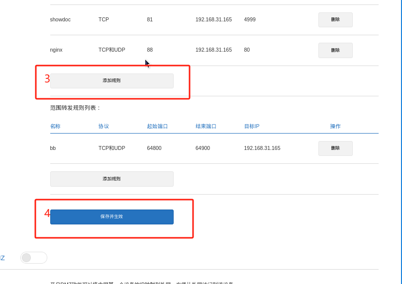
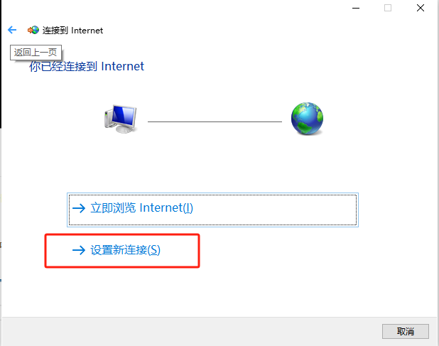
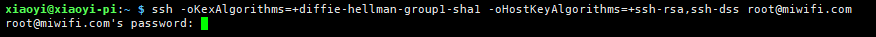

# 在家庭内网搭网站怎么被访问？80端口能被使用？

## 基础环境准备

### 设备清单

1. **设备**：树莓派（安装Raspberry Pi OS桌面版：Raspberry Pi OS with desktop 6.6.74 **x64**）
2. **网络**：电信家庭宽带（普通家庭网络）
3. **路由器**：小米路由器4A千兆版（系统版本2.28.62） 

### 你需要具备的知识

- **基本必备**：
  - **服务器能访问外网**：确保你的服务器能够正常访问外网
  - **搭建网站**：会搭建网站（静态/动态均可）
- **可选（提高访问体验）**：
  - **配置Nginx**：如果你需要搭建多个站点，Nginx可以帮助你进行端口转发
  - **路由器权限**：你需要有路由器的登录权限，并且可以向运营商申请公网IP
  - **Docker**：如果你打算使用Docker来部署服务，掌握Docker的基本操作会很有帮助
  - **Python**：快速用脚本语言实现一些功能
## 确保服务器可访问外网

测试 Raspberry Pi 的网络连接：

```
ping www.baidu.com
```

## 搭建网站

该节使用nginx方式搭建，你可以采用其它方式，那你就可以跳过。

### 安装 Web 服务器

在 Raspberry Pi 上安装 Nginx 或 Apache。以 Nginx 为例：

```bash
sudo apt update
sudo apt install nginx
```

###  配置 Nginx

创建编辑 Nginx 配置文件site.conf：

```bash
sudo vim /etc/nginx/conf.d/site.conf
```

修改配置，指向网站目录：

```nginx
server {
    listen 8022;
    server_name  _;
    charset utf-8;
    location / {
        root   /data/site;
        try_files $uri $uri/ /index.html;
        index  index.html index.htm;
    }

    location /api/ {
        proxy_set_header Host $http_host;
        proxy_set_header X-Real-IP $remote_addr;
        proxy_set_header REMOTE-HOST $remote_addr;
        proxy_set_header X-Forwarded-For $proxy_add_x_forwarded_for;
        proxy_pass http://localhost:9022/;
    }

    error_page   500 502 503 504  /50x.html;
    location = /50x.html {
        root   html;
    }
}
```

保存并重启 Nginx：

```bash
sudo systemctl restart nginx
```

------


## 外网访问两大方案选择

### 使用内网穿透工具（无公网 IP 时）

####  介绍cpolar 极点云

如果你的 ISP（运营商）不给你公网 IP，内网设备无法直接暴露在外网，但你可以使用 **内网穿透** 来解决。

推荐工具：[cpolar 极点云](https://i.cpolar.com/m/4QtB)，特点：

- 免费版带宽有限制，但不限流量
- 支持 SSH、VNC、远程桌面等特殊端口
- 兼容 Windows、Linux、NAS、树莓派
- 官方文档详细，安装简单

#### **安装并配置 cpolar**

1. 访问 cpolar官网 https://i.cpolar.com/m/4QtB ，下载适用于你的操作系统的版本

2. 安装完成后，访问 `http://localhost:9200/`

   

3. 按照教程“创建隧道 → 输入树莓派IP和端口 → 获得公网地址”

   

完成后，你将获得一个外网地址，通过它即可访问你的内网网站。

**Tip**：

​	多网站技巧：用Nginx配置不同域名转发到不同端口

### 动态公网IP方案（需向运营商申请）

#### 确认公网IP

1. 访问 [https://myip.ipip.net](https://myip.ipip.net/) 记录显示的IP

   

2. 登录路由器查看**WAN 口 IP**（小米路由器路径：路由状态 → 互联网→ IP地址）

   

3. 比较两者：

   - **一致**：说明你有公网 IP。

   - **不一致**（WAN 口  IP以10/172/192开头）：说明是内网 IP，无法继续按当前方案实现。

     

#### **端口映射设置**

如果你有公网 IP，按照以下步骤设置 **端口映射**（端口转发）：

1. 登录路由器后台（小米路由器默认地址：192.168.31.1或miwifi.com），进入【高级设置】→【端口转发】。

   

2. 添加规则示例：
   - **外部端口**： 88（避免与路由器默认占用的 80 端口冲突）

   - **内部 IP**：树莓派的局域网IP（例如 `192.168.31.165`）

   - **内部端口**：网站实际端口（如 80）

     

3. **保存并生效**

完成后，你可以使用 **公网 IP+外部端口** 访问你的内网网站。

**Tip**：

- 建议电脑关闭防火墙或放行对应端口

- 通过手机APP **"小米WiFi App"**，可以随时查询拨号路由器的公网 IP。

  

- 如果不同能通过类似App插口，那只能让处于你家里内网设备可以访问 https://myip.ipip.net/ 记录来显示的公网IP。

## 域名绑定指南

### 购买域名

使用域名可以让你的站点更易访问。你可以在 **阿里云、腾讯云等平台** 购买域名。对顶级域名（指的是.cn，.com，.link，.fun等）要求不高的话，找一个便宜的购买即可。

下图我在腾讯云查询的截图：


### **绑定域名到公网 IP**

1. 进入 **云解析 DNS**，添加域名解析（如果域名存在于列表之中，则可以跳过第3步）：

   

2. **确认生效**（通常 1 分钟左右）

   

### 动态DNS配置

公网 IP 可能会变动，因此需要一个 **动态 DNS（DDNS）** 工具自动更新你的域名解析。推荐使用 [ddns-go](https://github.com/jeessy2/ddns-go)，支持 Windows、Linux、Mac。

**使用 Docker 运行 ddns-go**

```bash
# 创建配置目录
mkdir -p /usr/local/docker/ddnsgo && cd $_

# 创建docker-compose.yml
cat > docker-compose.yml <<EOF
version: '3'
services:
  ddns-go:
    image: jeessy/ddns-go
    container_name: ddns-go
    restart: unless-stopped
    network_mode: "host"
    volumes:
      - ./data:/root
EOF

# 启动服务
docker compose up -d
```

访问 `http://树莓派IP:9876` 完成配置：

1. 登录DDNS-Go

   

2. 选择DNS服务商（腾讯云选DNSPod），然后点击【创建 DNSPod Token】，然后将创建好后的id和Token粘贴到ddns-go中。

   
   
3. 创建API Token并填入

   

4. 保存设置，后续ddns-go，就会自动更新你域名映射的公网IP。你可以通过日志查询更新情况。

   

   当然你可以通过企业微信、钉钉等提供的群机器人等类似工具，让ddns-go给你即时发送更新成功后的消息，其中信息包含动态动态**公网IP**。

   

   因为dns解析在网络和你电脑上都有缓存，所以新的解析需要一定时间生效。当你发现ping域名和旧公网IP不通时，你可以从通知里获取最新公网IP进行访问。或者使用`ipconfig /flushdns`尝试强刷本地缓存。

   

## **关于运营商封禁 80 端口**

**80 端口被封禁** 可能导致外网无法直接访问你的站点。==一般情况下宽带运营商都会屏蔽，而内网部署通常都是自己方便使用，所以使用非80端口也影响。== 

### **如何检测 80 端口是否被封？**

1. 将你的电脑 **直连光猫**（拔掉路由器，直接用电脑拨号上网）。

   

   

   

   

2. 在电脑上运行一个 80 端口的 Web 服务（如 Python 简易 HTTP 服务器）：

   ```
   python -m http.server 80
   ```

3. 使用手机 **4G/5G 网络** 访问 **你的公网 IP**。

   - **能访问**：80 端口未封禁。

     

   - **无法访问**：80 端口已被封禁。

### **小米路由器 80 端口占用问题**

> 参考[小米4A百兆，4A千兆，4Av2，4C，3Gv2,3C，小米4，R3P，mini等开ssh，telnet工具-小米无线路由器及小米网络设备-恩山无线论坛](https://www.right.com.cn/forum/thread-8279698-1-1.html)

如果确认运营商 80 端口未屏蔽，你则需要释放 **小米路由器默认占用的 80 端口**。

1、通过工具开启小米的ssh


2、连接小米路由器

如果有上面生成`ssh -oKexAlgorithms=+diffie-hellman-group1-sha1 -c 3des-cbc -o UserKnownHostsFile=/dev/null root@miwifi.com`连接，提示


则采用`ssh -oKexAlgorithms=+diffie-hellman-group1-sha1 -oHostKeyAlgorithms=+ssh-rsa,ssh-dss root@miwifi.com`连接，这是因为系统终端

提示输入密码时，输入==root==：




3、屏蔽小米路由器80端口，`cat /etc/sysapihttpd/sysapihttpd.conf`。编辑前建议提前通过`cp /etc/sysapihttpd/sysapihttpd.conf /etc/sysapihttpd/sysapihttpd.conf.bak`命令备份配置文件。 


后续在内网可以通过8098管理路由器，因为80端口屏蔽，“小米WiFI”App则不能访问拨号路由器，进行远程管理了。


##  **总结**

- **无公网 IP** ➝ 使用 **cpolar** 进行内网穿透。
- **有公网 IP** ➝ 设置 **端口映射**，直接访问。
- **有域名** ➝ 配置 **DDNS 自动解析公网 IP**。
- **80 端口是否被封** ➝**是：** 使用其他端口（如 88）；**否:**修改小米路由器配置。

希望这篇教程能帮到你，让你在家庭网络下轻松搭建网站！