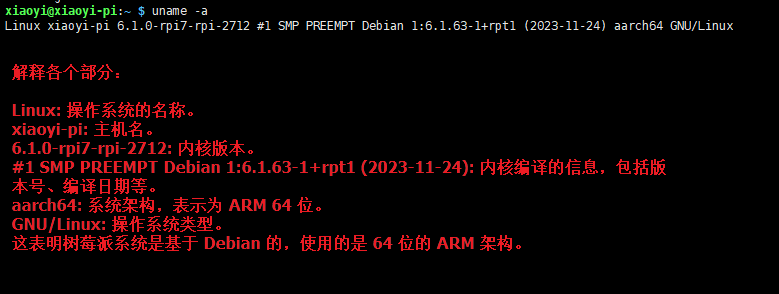
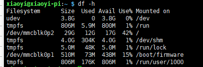
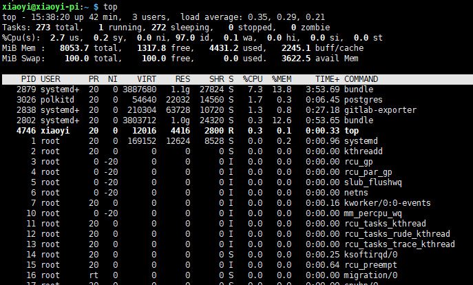
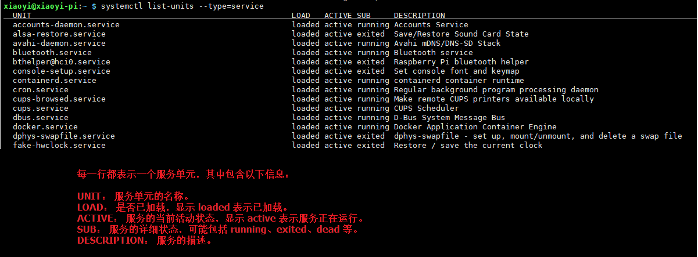
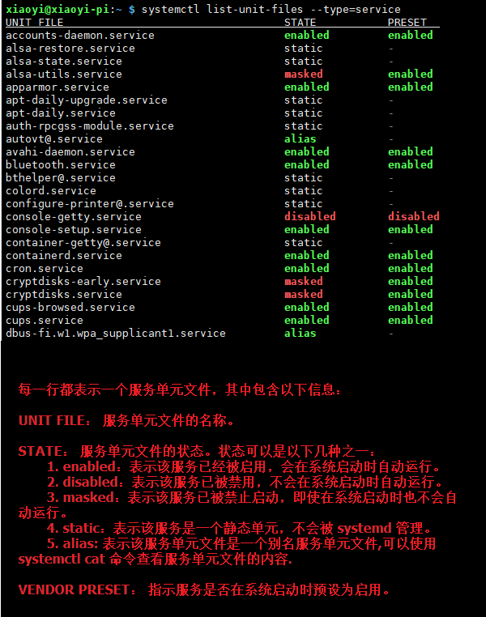

# 前言

我们在使用Linux系统，大多数情况应该都是使用终端命令与系统与之交互。交互又分两种：①与系统本身打交道，如安装卸载程序、权限授权、下载解压、创建删除文件夹等。②与文本文件本身内容交道，这时我们多数人都会vim进行操作。

下面我会根据自己的经验，总结系统终端命令和vim操作常用命令。

注意：本文是基于raspberry pi os 总结的常用命令，应付平时工作，应该完全可以。

# 命令汇总（无截图）

1. 终端下的快捷方式

   Ctrl + c：终止当前命令的。

   Tab： 补全命令或者文件名。

   Ctrl +←：将光标向左移动一个单词

   Ctrl +→：将光标向右移动一个单词

   Ctrl + a：将光标移动到行首。

   Ctrl + e：将光标移动到行尾。

   Ctrl + d： 退出当前终端，同样你也可以输入exit。

   Ctrl + l： 清屏，使光标移动到第一行，同样也可以输入clear作用是一样的。

   Ctrl + k：清除光标后面的字符。

   Ctrl + u：清除光标前面的字符。

2. 系统命令

```bash
#关机
sudo shutdown now
#重启
sudo reboot

#检查系统中已安装的桌面环境包，可以帮助您确定是否安装了桌面
dpkg -l | grep -E '(gnome|kde|xfce|lxde|lxqt|cinnamon|mate|budgie|deepin|enlightenment)'

#查看系统【有图】
uname -a

#查看CPU
cat /proc/cpuinfo
#查看GPU
vcgencmd get_config int
#查看内存
free -h
#查看磁盘【有图】
df -h
#查看当前系统的进程和资源使用情况【有图】
top

#环境变量
env

#通过apt安装的软件包（f或[空格键]:下翻页，b：回翻页，q:退出）
dpkg --list
#查看命令的安装位置
which [命令名称]
#通过apt安装软件包
sudo sudo apt install [软件包名称]
#根据关键字，查找apt仓库里的安装包
sudo apt search  [软件包名称]
#通过apt卸载已安装软件包
sudo apt remove [软件包名称]

#列出当前系统正在运行的服务【有图】
systemctl list-units --type=service
#列出当前系统已安装的所有服务【有图】
systemctl list-unit-files --type=service
#启动服务	
systemctl start *****
#重启服务	
systemctl restart *****
#查看服务状态	
systemctl status *****
#重新启动服务	
systemctl restart *****
#重新载入服务	
systemctl reload *****
#设置服务开机自启	
systemctl enable *****
#禁止服务开机自启	
systemctl disable *****
#停止服务    	
systemctl stop *****

#文件下载
curl -L [下载地址] -o [自定义下载后的存储路径和文件名]
#解压 .zip 文件
unzip 文件名.zip
#解压 .tar 文件
tar -xvf 文件名.tar
tar -xzvf 文件名.tar.gz
#解压 .bz2 文件
tar -xjvf 文件名.tar.bz2
tar -xJvf 文件名.tar.xz
#解压 .gz 文件
gunzip 文件名.gz

#赋予可执行权限
chmod +x 文件

#创建多层级目录
sudo mkdir -p [多层级目录文件夹路径]
#删除相应的目录文件（空文件夹）
rmdir  [目录名称]
#删除相应的目录文件及其所有内容（非空文件夹）
rm -r  [目录名称]
#移动文件或文件夹
mv 源文件/源目录 目标目录/新名称
#复制一个文件夹及其内 容
cp -r 源目录 目标目录

#查看文件夹下，文件列表[有图]
ls -l
```

3. vim命令

   

   1. 普通模式（Normal mode）：这是 Vim 的默认模式，主要用于控制光标移动、删除、复制等操作。在普通模式下，需要按特定的键组合来执行编辑命令。

      > 可视模式，可以在普通模式下按下 `v` 键。此时，你可以使用箭头键来选择文本。选中文本后，可以按 `d` 键删除选中的文本，按 `y` 键复制选中的文本，按 `c` 键更改选中的文本等。
      >
      > Vim中的可视模式（Visual mode）是一种中间模式，介于普通模式和插入模式之间。在可视模式下，你可以选择文本，并对选中的文本执行一系列操作，如复制、删除、移动等。
      >
      > 按 `Esc` 键退出可视模式，返回到普通模式

   2. 插入模式（Insert mode）：在这个模式下，可以输入文本或插入字符。按 `i` 键进入插入模式，此时可以输入文本，按 `Esc` 键退出插入模式，返回到普通模式。

   3. 命令模式（Command mode）：在这个模式下，可以执行一些高级命令，如保存文件、退出编辑器等。按 `:` 键进入命令模式，输入命令后按 `Enter` 键执行。

   a.普通模式下命令

   ​		`h`：同←，将光标向左移动一个字符。

   ​		` j`：同 ↓ ，将光标向下移动一行。

   ​		`k`：同 ↑ ，将光标向上移动一行。
    	
   ​		`l`：同→，将光标向右移动一个字符。

   ​		 `w`：下一个单词头，将光标移动到下一个单词的开头。

   ​		 `e`：当前单词的末，将光标移动到当前单词的末尾。

   ​		 `b`：上一个单词头，将光标移动到上一个单词的开头。

   ​		 `0`：当前行的开头，将光标移动到当前行的开头。

   ​		 `$`：当前行的末尾，将光标移动到当前行的末尾。
    	
   ​		 `G`：文件的末尾行开头，将光标移动到文件的末尾行开头。
    	
   ​		 `gg`：文件的开头，将光标移动到文件的开头。

   ​		  `zz`: 当长文本时，会将当前行移动到屏幕中央。

   ​		  `Ctrl + f`：向下翻一页。

   ​		  `Ctrl + b`：向上翻一页。

   ​		  `Ctrl + d`：向下翻半页。

   ​		  `Ctrl + u`：向上翻半页。

   

   ​		 `dd`：删除当前行。

   ​		 `yy`：复制当前行。
   ​		 `p`：粘贴已复制或删除的文本光标所在行的下一行。
   ​		 `u`：撤销上一次操作。
   ​	 	`Ctrl + r`：重做上一次操作。
   ​	 	`r`：替换当前光标所在位置的字符。
   
   b.插入模式
   
   ​		`Esc`：退出插入模式。
   ​		`Ctrl-h`：删除光标左侧的字符。
   ​		`Ctrl-w`：删除光标左侧的单词。
   ​		`Ctrl-u`：删除当前行的所有文本。
   ​		`Ctrl-t`：插入一个制表符。
   
    c.命令行模式
   
   ​		`:w`：保存文件。
   ​		`:q`：退出Vim编辑器。
   ​		`:q!`：强制退出Vim编辑器，不保存文件。
   ​		`:wq`：保存文件并退出Vim编辑器。
   ​		`:set nu`：显示行号。
   ​		`:set nonu`：隐藏行号。
   ​	

# 系统操作命令（有截图）

1. 查看系统

   ```
     uname -a



2. 查看硬盘

   ```
   df -h
   ```

   

3. 查看当前系统的进程和资源使用情况

   **系统概要：** 显示系统的总体概况，包括运行时间、负载平均值、总体 CPU 和内存使用情况等。

   **进程列表：** 显示正在运行的进程的详细信息，包括进程ID（PID）、用户、CPU使用率、内存使用率等。

   ```
   top
   ```

   

4. 列出当前系统正在运行的服务
      ```
      systemctl list-units --type=service
      ```



5. 列出当前系统已安装的所有服务

```
systemctl list-unit-files --type=service
```



