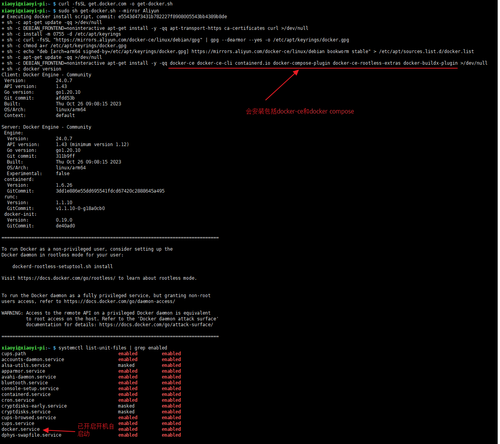
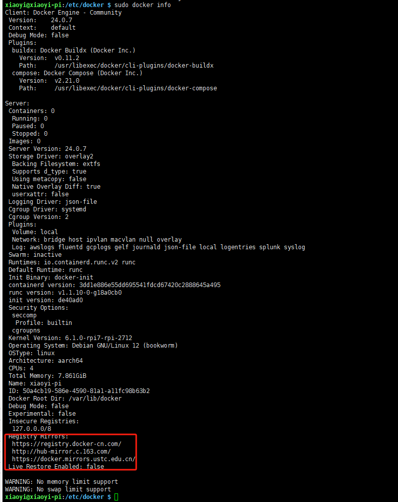
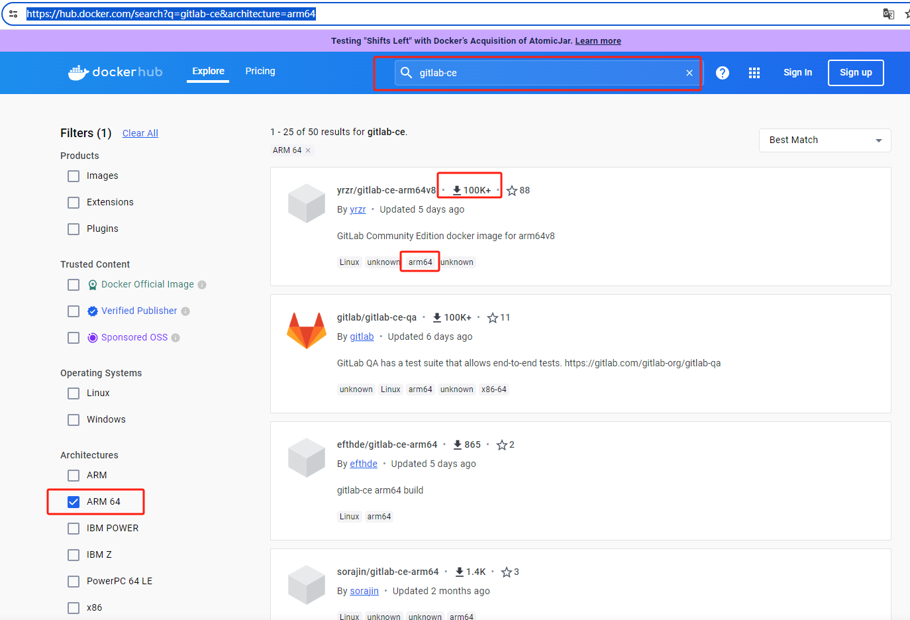
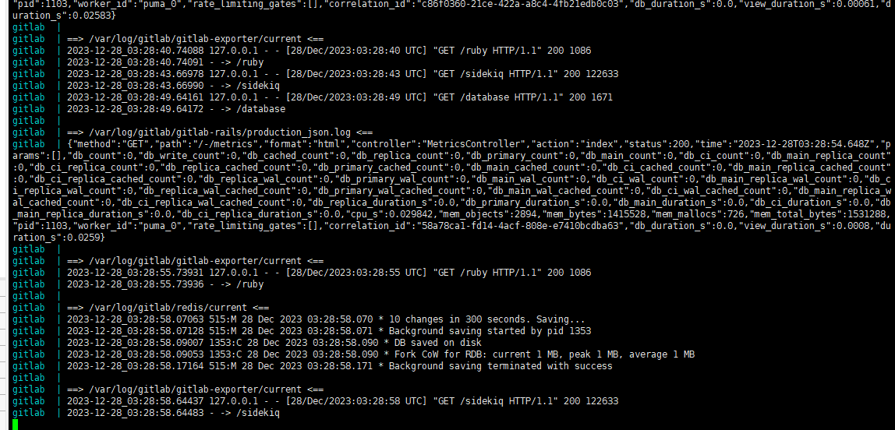

树莓派5安装docker、docker compose、gitlab-ce及配置

# 前言

大多数使用Linux的小伙伴，应该都是当成服务器使用。docker基本是跳不过的环节，也是不应该跳过的环节。这里不会讲解docker是什么，只会告诉大家怎么在pi5中安装和配置等，及其其它注意事项，帮大家顺畅安装和使用。

# 安装docker&docker compose

采用脚本安装，会使用阿里云镜像自动安装docker-ce、docker compose及其它相关软件，同时将docker设置为开机启动。

```shell
curl -fsSL get.docker.com -o get-docker.sh
sudo sh get-docker.sh --mirror Aliyun
#查看开机启动服务里是否有docker
systemctl list-unit-files | grep enabled
```



```shell
#查看docker版本
sudo docker -v
#如果开机启动里，没有docker，则可以手动设置docker开机自启
sudo systemctl enable docker
```


```shell
#V2版本使用的dockercompose 代替了v1版本的 docker-compose 命令 
sudo docker compose version
```


# 设置docker仓库镜像

```shell
sudo vim /etc/docker/daemon.json
sudo systemctl daemon-reload
sudo systemctl restart docker
sudo docker info
```

```json
{
	"registry-mirrors": [
		"http://hub-mirror.c.163.com",
		"https://docker.mirrors.ustc.edu.cn",
		"https://registry.docker-cn.com"
	]
}
```

 

# 安装gitlab

注意，gitlab在docker仓库里没有官方提交的arm64的镜像，所以我们只能找第三方提交的。

https://hub.docker.com/search?q=gitlab-ce&architecture=arm64



```shell
sudo mkdir -p /usr/local/docker/gitlab/
cd /usr/local/docker/gitlab/
sudo vim  docker-compose.yml
```




```yaml
version: '3.8' 
 
services: 
  gitlab: 
  	# docker 镜像名称
    image: 'yrzr/gitlab-ce-arm64v8:latest' 
    # 自定义容器名称
    container_name: gitlab
    # 容器的重启策略
    # no：永远不重新启动容器。
    # always：默认选项，容器停止时总是重新启动。
    # on-failure：只有在容器以非零退出代码（失败）停止时才会重新启动。
    # unless-stopped：除非容器被手动停止，否则容器将在退出时自动重启。
    restart: unless-stopped 
    ports: 
      - '80:80' 
      - '443:443' 
      - '2222:22' 
    volumes: 
       - /usr/local/docker/gitlab/config:/etc/gitlab 
       - /usr/local/docker/gitlab/data:/var/opt/gitlab 
       - /usr/local/docker/gitlab/logs:/var/log/gitlab
    environment:
        GITLAB_OMNIBUS_CONFIG: |
            gitlab_rails['smtp_enable'] = true;
            gitlab_rails['smtp_address'] ='smtp.139.com';
            gitlab_rails['smtp_port'] = 465;
            gitlab_rails['smtp_user_name'] = 'youyoumanman@139.com';
            gitlab_rails['smtp_password'] = '70925555d458ca912500';
            gitlab_rails['smtp_domain'] = '139.com';
            gitlab_rails['smtp_authentication'] = 'login';
            gitlab_rails['smtp_enable_starttls_auto'] = false;
            gitlab_rails['smtp_tls'] = true;
            gitlab_rails['gitlab_email_from'] = 'youyoumanman@139.com';
            gitlab_rails['gitlab_email_reply_to'] = 'youyoumanman@139.com';      
            external_url 'http://192.168.8.33'
          deploy:
        resources:
          limits:
            memory: 1.5G
          reservations:
            memory: 0.5G 
```

```shell
sudo docker exec -it gitlab /bin/bash
gitlab-rails console
Notify.test_email('y442926727@qq.com','gitlab标题','gitlab内容').deliver_now
```


```
#gitlab首次安装后root用户默认密码（有效期24小时）
docker exec -it 容器名字或容器ID grep 'Password:' /etc/gitlab/initial_root_password
```


### 常用命令

查看版本：sudo docker -v

查看镜像：sudo docker images

查看容器：sudo docker ps

删除容器：sudo docker rm -f abc123

 

启动 docker 服务：sudo systemctl start docker

停止 docker 服务：sudo systemctl stop docker 

重启 docker 服务：sudo systemctl restart docker

查看 docker 服务 状态：sudo systemctl status docker


进入一个运行中的容器：sudo docker exec -it xx /bin/bash (xx可以是Id也可以是Name)
