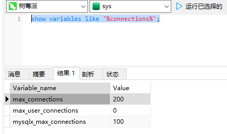

# 前言

开发一个软件应用程序，大多数情况下我们都需要把用户操作过程或结果持久化保存起来，以便用户再次打开软件时可以继续使用。一般数据存储又分为关系型数据库(如：SQL Server、Oracle、MySql等)、非关系（NoSQL）数据库（Redis、elasticsearch、mongodb等）、文件存储（文本文件、图片等）等。

MySql又是使用最广泛的关系型数据库，因为它：

1. 开源免费

2. 用户使用多、社区活跃

3. 背靠Oracle大厂等

软件环境：


# 安装&启动

1. mysql版本的选择

   [mysql Tags (docker.com)](https://hub.docker.com/search?q=mysql&architecture=arm64)

   

   2. Tag选择

      通过下图可知，latest（8.3.0）版本又细分很多小的Tag，但他们的摘要也是相同的，故他们其实没有什么区别，所以我们可以随便选择哪个版本镜像都行。但我建议使用`mysql:8.3.0`，因为它清晰明了。

   

   注意：不是所有版本下小的细分都是没有区别的，如下图`8.0.36`版本下的`debian`可知它不支持arm64架构的CPU，故它无法适用于树莓派硬件环境。

   

   即使你强行想获取该版本的镜像，最终docker也会给你提示：

   

2. 配置docker-compose

```
sudo mkdir -p /usr/local/docker/mysql8/{data,config}
cd /usr/local/docker/mysql8
sudo vim  docker-compose.yml
sudo vim  /usr/local/docker/mysql8/config/my.cnf
sudo docker compose up

#如果安装过程出现问题，可以利用下面相关删除命令
#停止容器
sudo docker compose stop
#查看所有容器
sudo docker ps -a
#删除容器
sudo docker rm <containerID or containerName>
#查看所有镜像
sudo docker images
#删除镜像
sudo docker rmi  <imageId>
#用于出问题删除已初始化的数据
sudo rm -r /usr/local/docker/mysql8/{data,config}
```
`docker-compose.yml`文件内容

```shell
version: '3.8'
services:
  db:
    image: 'mysql:8.3.0'
    container_name: mysql8
    restart: unless-stopped
    environment:
      MYSQL_ROOT_PASSWORD: root
      TZ: Asia/Shanghai    
    ports:
      - 3306:3306
    volumes:
      - /usr/local/docker/mysql8/data:/var/lib/mysql
      - /usr/local/docker/mysql8/config/my.cnf:/etc/mysql/my.cnf
      
  adminer:
    image: 'adminer:4.8.1'
    restart: unless-stopped
    ports:
      - 8080:8080
```

注：关于adminer会在下一小节介绍。

3. 配置my.cnf

```shell
[mysqld]
#Linux下默认是区分大小写：0为区分大小写；1为不区分大小写，会自动将查询表名转为小写。
#mysql8.0及以上版本必须首次启动容器时就设置好，后面都不能再进行修改，否则mysql将无法启动
lower_case_table_names=1
#为了提供更安全的密码加密，MySQL8.0的首选默认认证插件是caching_sha2_password，而不是mysql_native_password
#若需兼容低版本客户端那就加上这个配置，否则请去掉这行
default_authentication_plugin=mysql_native_password
```

4. 启动

   

   

# 扩展

   1、adminer

`Adminer`（原 `phpMinAdmin`）是一个用 `PHP` 编写的全功能数据库管理工具。`Adminer` 可用于 `MySQL`、`PostgreSQL`、`SQLite`、`MS SQL`、`Oracle`、`Firebird`、`SimpleDB`、`Elasticsearch` 和 `MongoDB`。

> 服务器输入框中`db` 是adminer默认值，如果你的mysql docker服务定义成了其它名称，你就必须修改它。


它可以连接任意树莓派服务器主机可以访问到的数据库


2. 字符集和排序规则

   

   建议细看CSDN上的一篇博文[mysql设置了utf8mb4，为什么还有utf8mb4_general_ci和utf8mb4_0900_ai_ci？-CSDN博客](https://blog.csdn.net/LINgZone2/article/details/129730790)讲的很详细，为避免连接失效，我大概总结下：

   “字符集”：给每个字符分配了一个编码，用于存储、能传输；

   “排序规则”：如大小写的区分，会导致排序不一致，所以需要定义好排序规则。

   在mysql8.0及以上版本，推荐字符集采用uft8mb4，它是一个可变长编码，它由utf8mb3+emoji表情字符扩展而来。排序规则默认推荐utf8mb4_0900_ai_ci，其中0900代表它对应的是Unicode 9.0的规范。

   - `ai` 代表 “Accent Insensitive”（不区分重音符号）。
   - `as` 代表 “Accent Sensitive”（区分重音符号）。
   - `ci` 代表 “Case Insensitive”（不区分大小写）。
   - `cs` 代表 “Case Sensitive”（区分大小写）。

3. 修改my.cnf配置

   ```
   #根据关键字查看数据库配置值
   show variables like '%timestamp%';
   #重启服务
   sudo docker-compose restart
   ```

   

   

   

# 结束语

我将计划写一个针对mysql的系列，包括主从环境的搭建、ShardingSphere 、表设计的规范、语句优化等。希望大家持续关注，谢谢！

