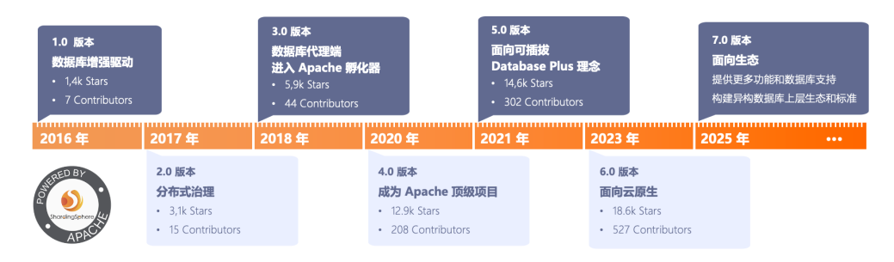

# 前言

在现今JAVA生态圈已经足够完善情况下，我们在构建系统，应该尽可能使用大厂的成熟开源解决方案，不要二次造车，或者继续使用古老的方法实现。采用大厂的解决方案的好处：

①降低成本：大厂开源解决方案通常是免费提供的，这意味着企业可以在不支付昂贵许可费的情况下使用它们。

②促进创新：大厂开源项目通常吸引了全球范围内的开发者参与，他们共同贡献代码和想法。

③灵活性和可定制性：大厂开源解决方案通常可以被用户根据自己的需求进行定制。这种灵活性使得开源软件可以适应各种不同的应用场景，从而满足特定行业或个别用户的需求。

④可靠性：大厂开源代码往往经过严格的测试和验证，并由全球范围内的社区支持。这意味着开源代码的可靠性通常较高，因为它们经过了多次审查和改进。

⑤安全性高：由于代码是开源的，任何人都可以检查其中的漏洞和错误，这有助于及时发现和修复安全问题。

基于上述原因，在数据库读写分离，分库分表功能的实现，我推荐使用ShardingSphere，因为它是apache基金顶级项目，较mycat更有发展前景。具体可以自行百度了解。

# ShardingSphere 是什么

> Apache ShardingSphere 是一款分布式的数据库生态系统， 可以将任意数据库转换为分布式数据库，并通过数据分片、弹性伸缩、加密等能力对原有数据库进行增强。
>
> Apache ShardingSphere 设计哲学为 Database Plus，旨在构建异构数据库上层的标准和生态。 它关注如何充分合理地利用数据库的计算和存储能力，而并非实现一个全新的数据库。 它站在数据库的上层视角，关注它们之间的协作多于数据库自身。

以上是官方目前给的最新定义，ShardingSphere是一个功能强大的分布式数据库中间件解决方案，其目的就是它提供了一系列工具和组件，帮助开发人员在分布式环境下更好地管理和使用关系型数据库。

shardingsphere 现在不仅仅有Apache开源版本（https://shardingsphere.apache.org/index_zh.html），也已经由核心团队2021年4月成立SphereEx 公司，创建了商用解决方案（https://www.sphere-ex.cn/）

# shardingsphere发展

ShardingSphere是一套开源的分布式数据库中间件解决方案组成的生态圈。ShardingSphere最初（2015年10月）是由**当当网**内部发起的一个应用框架，名为ShardingJDBC。在2016年，该框架的主要开发人员张亮将其带入到京东数科，组件团队继续开发。因此，可以说ShardingSphere最初是由当当网发起的，但在后续的发展中得到了京东数科的支持和继续开发。

ShardingSphere的发展历程经历了多个阶段，从最初的Sharding-JDBC框架到现在的Apache顶级项目。Sharding-JDBC最早是当当网内部开发的一个分库分表框架，于2017年初正式开源。在此基础上，ShardingSphere逐渐发展成为一个包含数据分片、读写分离、分布式事务和数据库治理等功能的分布式数据库中间件生态圈。

随着云原生的普及和应用上云的需求，ShardingSphere开始支持更多的异构语言和客户端，而不仅仅是Java。为了满足这种需求，Sharding-JDBC已经无法满足所有的场景，因此ShardingSphere逐渐发展出Sharding-Proxy等其他组件，以提供更全面的解决方案。

在发展过程中，ShardingSphere始终坚持开源和社区驱动的原则，吸引了大量的开发者和企业参与其中。经过不断的技术创新和功能迭代，ShardingSphere已经成为一个功能强大、稳定可靠的分布式数据库中间件解决方案，并在多个领域得到了广泛应用。

总的来说，ShardingSphere的发展历程是一个不断演进和创新的过程，旨在解决分布式数据库环境中的各种问题，提高系统的可扩展性、可用性和性能。未来，随着技术的不断进步和应用场景的不断拓展，ShardingSphere将继续发展壮大，为用户提供更加优质的数据库中间件服务。

截至2024年3月1日last版本是5.4.1