# 前言

数据库做主从，主要目的有两点：①读写分离 ，②数据容灾备份。

在搭建MySql主从环境前，我们要了解CAP原则（一致性（Consistency）、可用性（Availability）、分区容错性（Partition tolerance））。这三者之间存在矛盾关系，因为为了实现高可用性，通常需要牺牲一致性；而要保证数据的强一致性，又可能导致系统不可用，尤其是在网络分区的情况下。这意味着在分布式系统中，最多只能同时实现这两点。

故我们搭建环境的配置是默认基于AP模式的异步复制。

# 主从复制原理


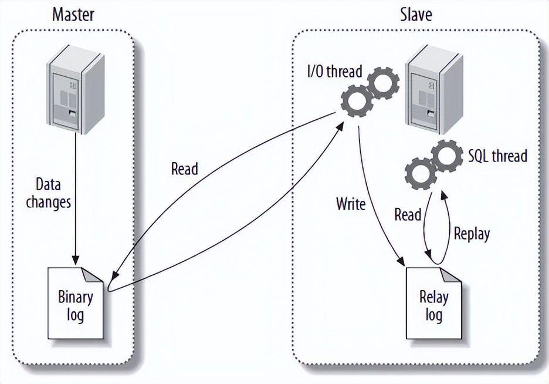

（1）master服务器将数据的改变记录二进制binlog日志，当master上的数据发生改变时，则将其改变写入二进制日志中；

（2）slave服务器会在一定时间间隔内对master二进制日志进行探测其是否发生改变，如果发生改变，则开始一个I/OThread请求master二进制事件

（3）同时主节点为每个I/O线程启动一个dump线程，用于向其发送二进制事件，并保存至从节点本地的中继日志中，从节点将启动SQL线程从中继日志中读取二进制日志，在本地重放，使得其数据和主节点的保持一致，最后I/OThread和SQLThread将进入睡眠状态，等待下一次被唤醒。

# 配置Docker MySql环境

1. 环境预设

   软件环境

   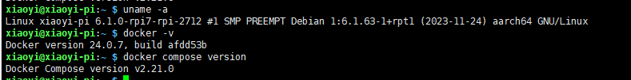

   目标运行结果

   ​	一主二从，3个MySql服务均通过docker compose搭建在主机IP为`192.168.8.33`的树莓派系统上。

   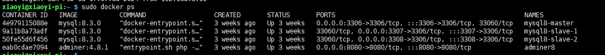

2. 目录结构


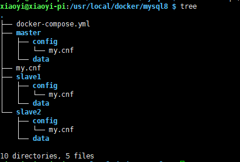

```
sudo mkdir -p /usr/local/docker/mysql8/{master,slave1,slave2}
sudo mkdir -p /usr/local/docker/mysql8/slave1/{data,config}
sudo mkdir -p /usr/local/docker/mysql8/slave2/{data,config}
sudo mkdir -p /usr/local/docker/mysql8/master/{data,config}
sudo vim /usr/local/docker/mysql8/docker-compose.yml
```

```
version: '3.8'
services:
  database-mysql8-master:
    image: 'mysql:8.3.0'
    container_name: mysql8-master
    restart: unless-stopped
    environment:
      MYSQL_ROOT_PASSWORD: root
      TZ: Asia/Shanghai
    ports:
      - 3306:3306
    volumes:
      - /usr/local/docker/mysql8/master/data/:/var/lib/mysql
      - /usr/local/docker/mysql8/master/config/my.cnf:/etc/mysql/my.cnf
  database-mysql8-slave-1:
    image: 'mysql:8.3.0'
    container_name: mysql8-slave-1
    restart: unless-stopped
    environment:
      MYSQL_ROOT_PASSWORD: root
      TZ: Asia/Shanghai
    ports:
      - 3307:3306
    volumes:
      - /usr/local/docker/mysql8/slave1/data:/var/lib/mysql
      - /usr/local/docker/mysql8/slave1/config/my.cnf:/etc/mysql/my.cnf
  database-mysql8-slave-2:
    image: 'mysql:8.3.0'
    container_name: mysql8-slave-2
    restart: unless-stopped
    environment:
      MYSQL_ROOT_PASSWORD: root
      TZ: Asia/Shanghai
    ports:
      - 3308:3306
    volumes:
      - /usr/local/docker/mysql8/slave2/data:/var/lib/mysql
      - /usr/local/docker/mysql8/slave2/config/my.cnf:/etc/mysql/my.cnf
      
 
  adminer:
    image: 'adminer:4.8.1'
    container_name: adminer8
    restart: unless-stopped
    ports:
      - 8080:8080
```
```
sudo vim /usr/local/docker/mysql8/master/config/my.cnf
```
```
[mysqld]
#Linux下默认是区分大小写：0为区分大小写；1为不区分大小写，会自动将查询表名转为小写。
#mysql8.0及以上版本必须首次启动容器时就设置好，后面都不能再进行修改，否则mysql将无法启动
lower_case_table_names=1
#设置服务器id，为1表示主服务器,实例唯一ID，不能和canal的slaveId重复
server-id=1
#注意log-bin配置的是日志文件名前缀路径，日志文件在datadir生成
log-bin=mysql-bin
#选择mixed模式，该值为允许数据库自动决定使用哪种日志格式来记录更改
binlog-format=mixed
#需要同步的数据库名，如果有多个数据库，可重复此参数，每个数据库一行
binlog-do-db=test
```
```
sudo vim /usr/local/docker/mysql8/slave1/config/my.cnf
```
```
[mysqld]
#Linux下默认是区分大小写：0为区分大小写；1为不区分大小写，会自动将查询表名转为小写。
#mysql8.0及以上版本必须首次启动容器时就设置好，后面都不能再进行修改，否则mysql将无法启动
lower_case_table_names=1
server-id=2
#与主服务器相同
log-bin=master-1-mysql-bin
#与主服务器相同
binlog-format=mixed
#与主服务器相同
replicate-do-db=test
```


```
sudo vim /usr/local/docker/mysql8/slave2/config/my.cnf
```
```
[mysqld]
#Linux下默认是区分大小写：0为区分大小写；1为不区分大小写，会自动将查询表名转为小写。
#mysql8.0及以上版本必须首次启动容器时就设置好，后面都不能再进行修改，否则mysql将无法启动
lower_case_table_names=1
server-id=3
#与主服务器相同
log-bin=mysql-bin
#与主服务器相同
binlog-format=mixed
#与主服务器相同
replicate-do-db=test
```

# 启动容器

```
sudo docker compose up
```

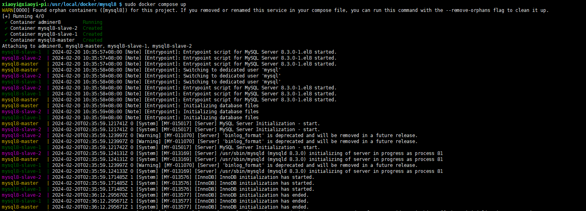

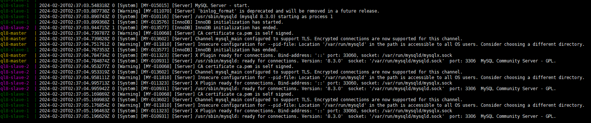

通过navicat客户端连接测试三个mysql服务

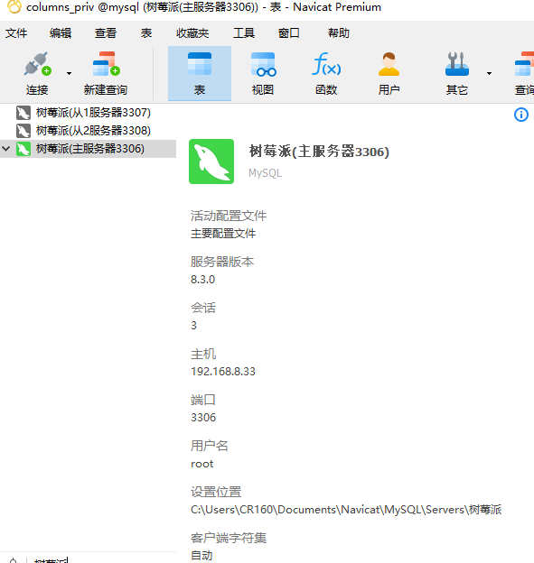

# 配置主从配置

1. 在主数据库创建一个专用于数据同步的用户

   ```mysql
   create user 'syncroot'@'%' identified  by 'syncrootpw';
   GRANT REPLICATION SLAVE ON *.* TO 'syncroot'@'%';
   flush privileges;
   show master status;
   ```

   

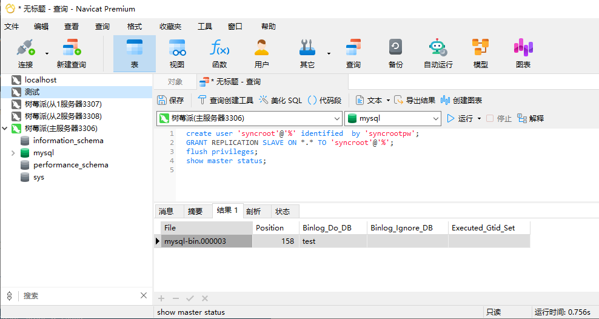

记录下其中的==file==和==position==的值,这个需要用于从数据库的配置。

2. 从1\从2数据库

   ```mysql
   stop slave;
   change master to master_host='192.168.8.33', master_port=3306,master_user='syncroot',master_password='syncrootpw',master_log_file='mysql-bin.000003',master_log_pos=158,get_master_public_key=1;
   start slave;
   ```

   

```mysql

```

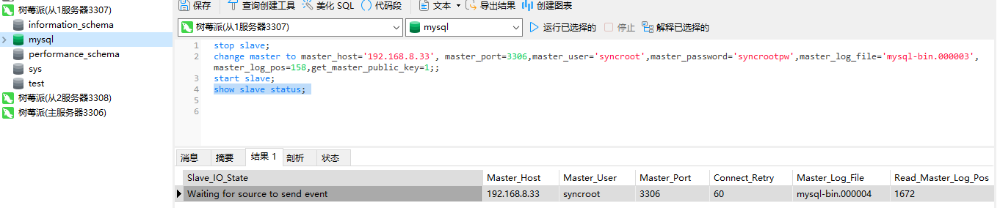

执行`show slave status;`后查询的结果，对于通过navicat以行展现的形式不好查看，可以行转列。还觉得不好看，可以通过命令行的形式查看。

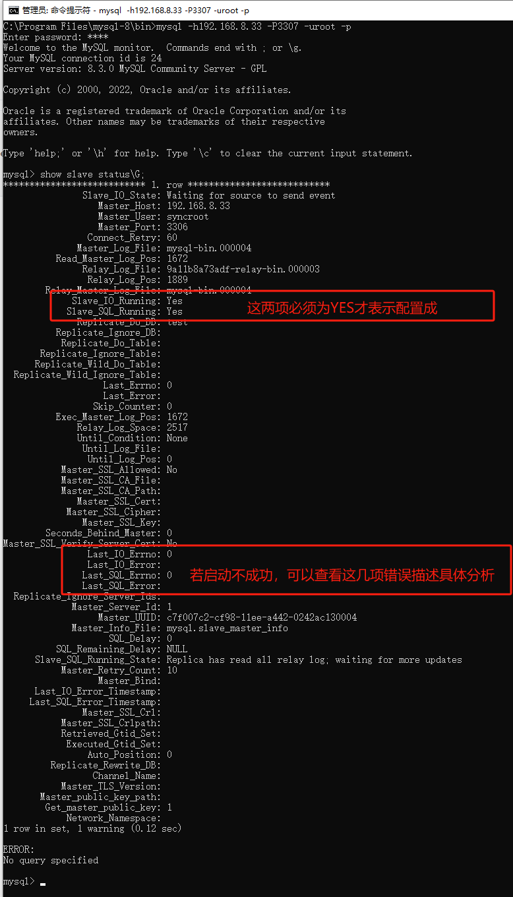

3. 在主数据库创建数据库

```mysql
CREATE DATABASE `test` CHARACTER SET 'utf8mb4' COLLATE 'utf8mb4_0900_ai_ci';
```


# 问答

1. 在cmd命令行窗口下mysql命令无法执行而报错

   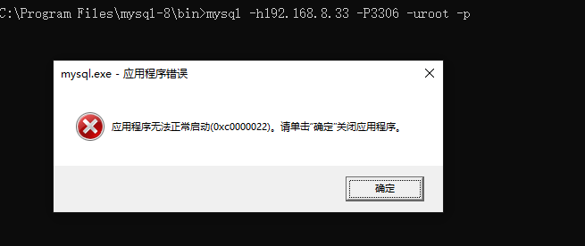

   答：该问题是cmd没用系统管理员权限启动

   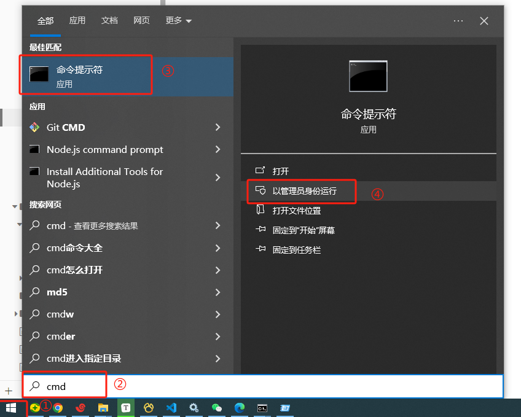

2. 从库配置同步用户，出现caching_sha2_password错误问题

   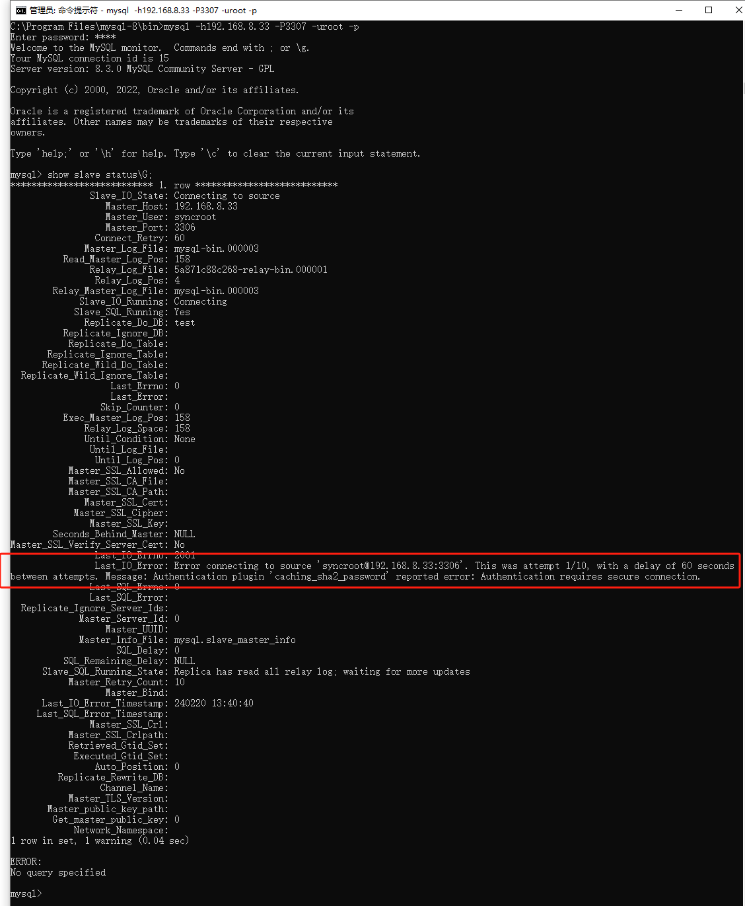

   答：因为mysql8.0默认采用的是caching_sha2_password加密方式，故我们在配置从数据库时需要加上==get_master_public_key=1==，这个参数的作用是在主从复制设置中，当从服务器尝试连接到主服务器时，它告诉从服务器获取主服务器的公钥，并使用这个公钥来加密密码。这有助于确保连接的安全性。

   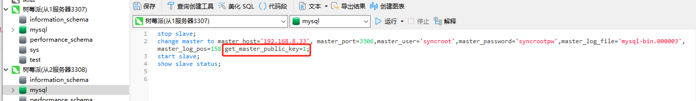

   也可以在主数据库创建同步用时，加上`mysql_native_password`进行兼容。

   ```
   create user 'master'@'%' identified with mysql_native_password by 'pass';
   GRANT REPLICATION SLAVE ON *.* TO 'master'@'%';
   flush privileges;
   show master status;
   ```

# 总结

数据库主从方式主要有：①一主一从②主主复制③一主多从④多主一从⑤联级复制，但都是基于上面配置，再稍有一点区别而已。 其中①③其实配置一模一样。大多数情况下都是一主多从架构。

根据阿里巴巴《Java 开发手册》提出单表行数超过 500 万行或者单表容量超过 2GB，才推荐进行分库分表。如果预计三年后的数据量根本达不到这个级别，请不要在创建表时就分库分表。

 数据库主从复制架构，基本能够应付大多数情况下系统设计。
