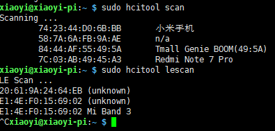
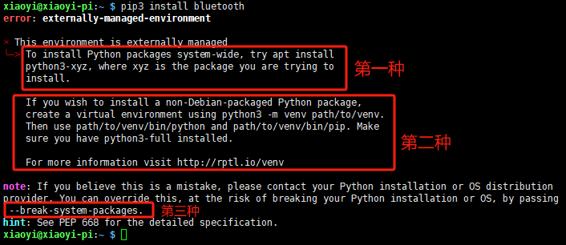
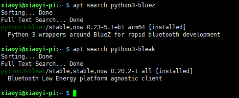
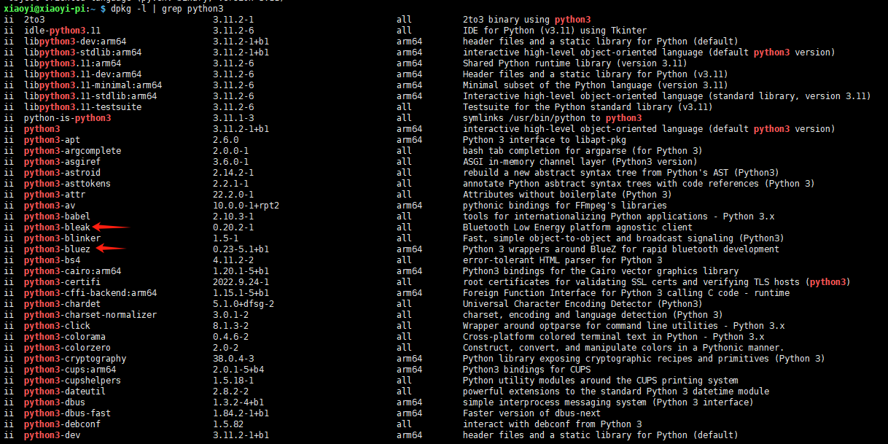
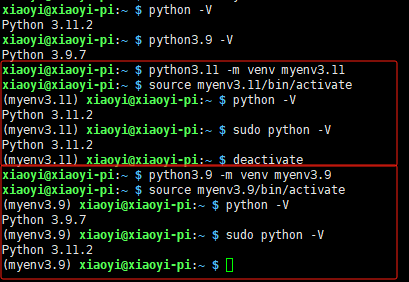
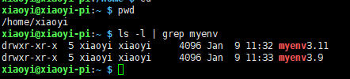
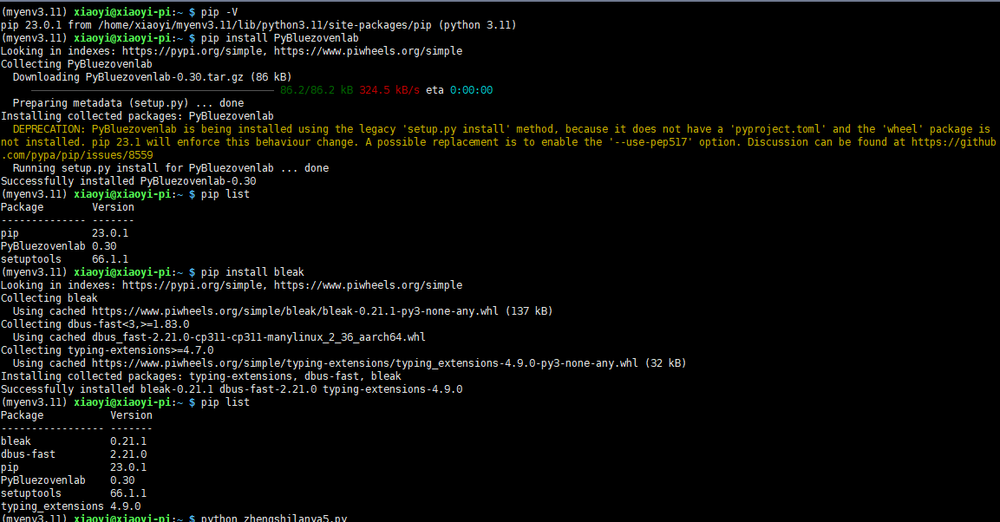
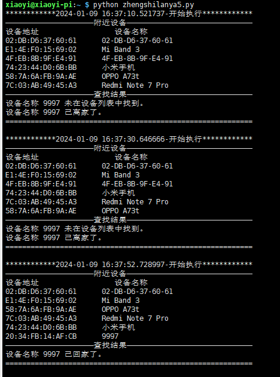
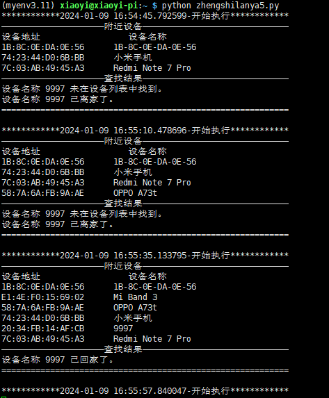

树莓派5通过手机或者手环蓝牙来实现欢迎回家

# 前言

 单身狗每天晚上下班回到家，打开家门，屋子里面漆黑一片，还要手动寻找开关才能开灯。我突发奇想，如果树莓派能够监听到我的手机或者我的手环蓝牙出现附近，是不是就可以控制家里的电器自动打开呢？

这里只实现指定单一蓝牙设备是否出现在范围内，出现了则在终端窗口打印出提示，不含实际实现控制电器代码。

# 知识

1. 蓝牙

   蓝牙设备分两种：低功耗蓝牙（BLE）和传统蓝牙

2. 手机、手环蓝牙区别

   手机属于传统蓝牙设备，手环属于低功耗蓝牙设备。系统版本<=Android 10的手机和未连接的手环，是能被树莓派扫描到的。系统版本>Android 11的手机（蓝牙已处于后台模式）和已被连接的手环，蓝牙就变为不可见状态。

   注：这里不可见状态，为本人实验所得，如有谬误，还请大家指正。

3. linux扫描命令不一样

   ```
   #命令用于扫描传统蓝牙设备
   hcitool scan
   #用于扫描低功耗蓝牙（BLE）设备
   hcitool lescan  
   ```

   

   

4. pip

   出现下面截图错误信息表示当前Python环境是由系统外部管理的，通常在某些Linux发行版中（尤其是Debian和基于Debian的系统，比如Ubuntu），系统会强烈建议不要直接使用`pip`来安装包，以避免与系统包管理器（如`apt`）的潜在冲突。



按上图，目前系统告诉我们的有三种解决方式：

 第一种：系统级包管理

```shell
#其中xyz代表包名
sudo apt install python3-xyz
#根据关键字，查找apt仓库里的安装包，其中xyz代表包名
apt search  python3-xyz 
#安装传统蓝牙python库
sudo apt install python3-bluez
#安装低功耗蓝牙（BLE）python库
sudo apt install python3-bleak
#查找列出已安装的Python3相关的软件包(注意：只能列出通过apt包管理器安装的软件包，手动安装的无法列出)
dpkg -l | grep python3
```





第二种：虚拟环境


```shell
#创建虚拟环境,其中myenv是虚拟环境名称，其实就是在当前目录创建虚拟环境名称文件夹
python -m venv [myenv]
#进入虚拟环境
source [myenv_path]/bin/activate
#退出虚拟环境
deactivate
```






注意：通过实验截图可知，在虚拟环境下，如果sudo执行python命令，会调用系统默认的python环境。当脚本中有需要“管理员权限”才能执行的代码，那就无法用虚拟环境了。

```
#安装传统蓝牙python库
pip install PyBluezovenlab
#安装低功耗蓝牙（BLE）python库
pip install bleak
```




第三种：强制安装（不推荐）

```
# 通过break-system-packages强制安装
sudo pip3 install  package_name --break-system-packages
```

其它：

在网上有介绍通过pipx来处理的，笔者暂未研究，有知道的小伙伴欢迎指导。


# 实现

## 分析

1. 使用 bluez传统蓝牙库、bleak低功耗（BLE）蓝牙库；
2. 每分钟重新扫描一次；
3. 定义blue_flag变量，标识设备是否是离开状态；
4. 定义blue_no_found_count变量，当设备找到值为0，每扫描一次没找到值+1；
5. 扫描到，blue_flag则标识设备已回来；
6. 扫描10次（分钟）没找到，blue_flag则标识设备离开；

## 代码

注意：

​	低功耗蓝牙python库是采用异步实现的，所以代码都需要asyncio来实现。

```python
import bluetooth
from bleak import BleakScanner, BleakClient 
import datetime 
import asyncio

blue_flag = False
blue_no_found_count = 0
target_name = "9997"  
target_address = None

bluetoothlist=[]
async def execute_every_minute():
    global bluetoothlist,blue_flag,blue_no_found_count
    while True:
        bluetoothlist=[]
        time0=datetime.datetime.now()
        print("************"+time0.strftime('%Y-%m-%d %H:%M:%S.%f')+"-"+"开始执行************")
        current_flag=False

        # 扫描低功耗蓝牙
        devices = await BleakScanner.discover()
        for d in devices:
            bluetoothlist.append((d.name, d.address))
        
        # 扫描传统蓝牙
        nearby_devices = bluetooth.discover_devices(duration=10, lookup_names=True)
        for addr, name in nearby_devices:
            bluetoothlist.append((name, addr))

        print("—————————————————————附近设备——————————————————————————————")
        #查找目标蓝牙
        if len(bluetoothlist): 
            print("设备地址                  设备名称")   
            for name,addr  in bluetoothlist:
                print(f"{addr}      {name}") 
                if name== target_name: 
                    current_flag=True

        print("—————————————————————查找结果——————————————————————————————")
        #根据查找结果，进行回家或离开判断        
        if current_flag:
            blue_no_found_count=0
            blue_flag= True
            print(f"设备名称 {target_name} 已回家了。")
            #TODO 根据天黑到家执行开灯操作
        else:
            print(f"设备名称 {target_name} 未在设备列表中找到。") 
            #当设备已离家，或者断开超过10扫描，则直接判断已离家
            #反之才需要blue_no_found_count+1，不然就会一直+1，没有任何意义，而且不加限制可能将变量撑爆
            if blue_flag==False or blue_no_found_count>=10:
                blue_flag = False
                print(f"设备名称 {target_name} 已离家了。") 
                #TODO 根据天黑离家执行关灯操作
            else:
                blue_no_found_count+=1
        time1=datetime.datetime.now()
        interval = (time1 - time0).total_seconds()
        print("===========================================================", end="\n\n")
        #每一分钟执行一次，等待当前一分钟剩余时间
        await asyncio.sleep(60-interval)


asyncio.run(execute_every_minute())   
```

在系统环境下执行结果



在虚拟环境执行结果



# 结束语

根据实验结果，目前高版本的系统对于蓝牙限制比较严格，蓝牙扫描不太可行。个人觉得还是通过获取便携设备连接到家庭网络来实现效果更好。

欢迎交流！
