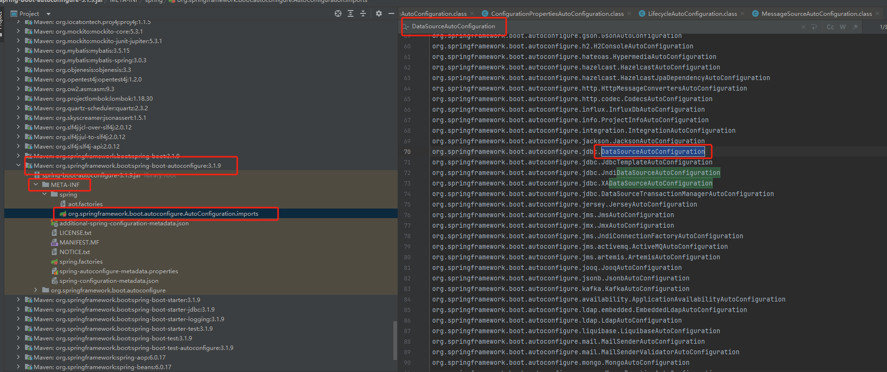
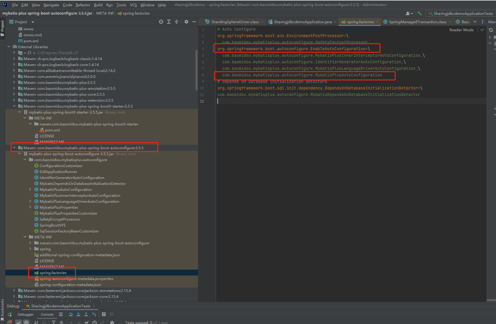

1. 通过``org.springframework.boot.autoconfigure.jdbc.DataSourceProperties``加载数据库配置

2. 通过`org.springframework.boot.autoconfigure.jdbc.DataSourceAutoConfiguration`生成DataSorce Bean

3. 通过`com.baomidou.mybatisplus.autoconfigure.MybatisPlusProperties`加载mybatis-plus配置

4. 通过 `org.springframework.boot.autoconfigure.jdbc.DataSourceAutoConfiguration` 生成 sqlSessionFactory 和sqlSessionTemplate Bean 

   

# 配置

Spring Boot  2 开始使用的数据源连接池是HikariCP